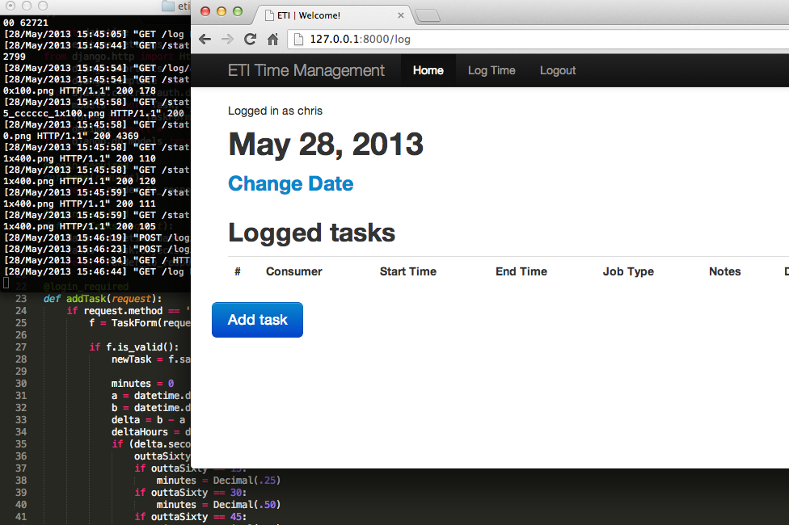
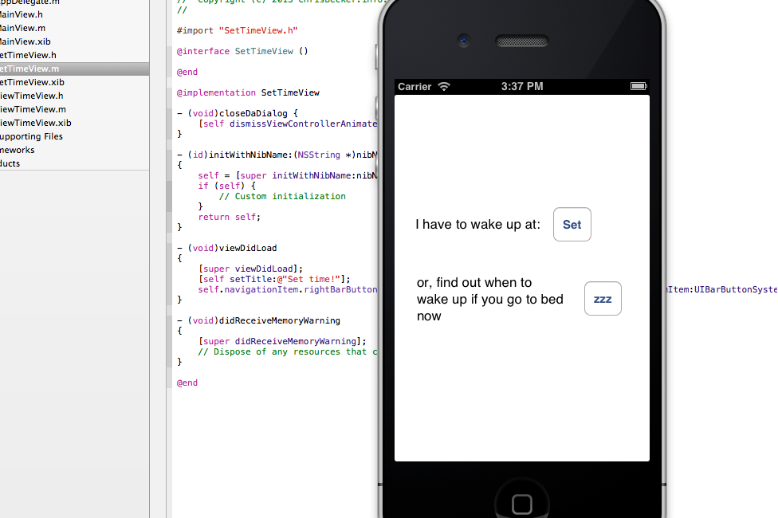

## Is My Train Fucked?

A silly python site that scrapes the New York City MTA API and displays whether or not your train line is fucked. Hint: it probably is.

[ismytrainfucked.com](http://ismytrainfucked.com)
(Python, Flask) - [source code on github](https://github.com/Cbeck527/is-my-train-fucked)

## The Wandering Photographers

The Wandering Photographers is a photo blog started by myself, Emily Shearing, and Ted Rysz. As we found ourselves on different coasts after college, we decided to document our our wanderings.

[thewanderingphotographers.com](http://thewanderingphotographers.com)
(PHP, koken)

## What's This Color

This tiny (and silly) site lets you quickly see what a color looks like without loading an annoying color picker or launching Photoshop.

[whatsthiscolor.com](http://whatsthiscolor.com)
(Python, [Flask](http://flask.pocoo.org/)) - [source code on github](https://github.com/Cbeck527/whats-this-color)

## ETI Time Card System

The ETI Time Card system was designed and developed by myself and Ted Rysz as our senior capstone project. This system helps employees of [EmpTech](http://emptech.org/) log their time to accurately report their hours out in the field.

(Python, [django](https://www.djangoproject.com/))

## Sleep Calculator for iOS

My first attempt at iOS development, inspired by [sleepyti.me](http://sleepyti.me)

(Objective-C, iOS)
