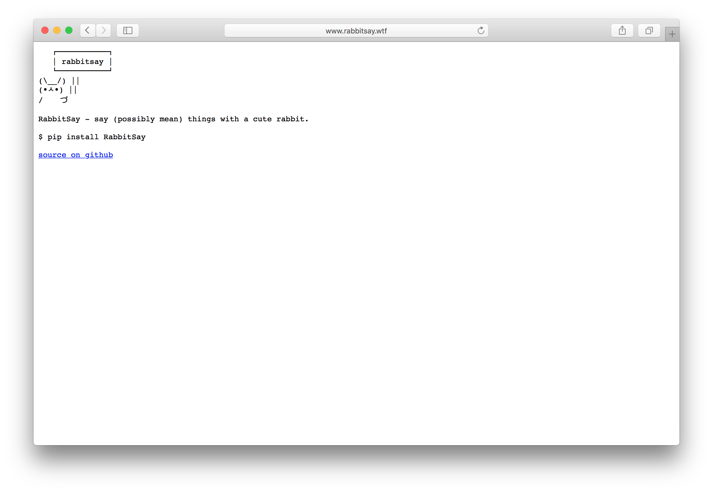

## Dishes.io

Use Alexa to keep track of your dishwasher.

[dishes.io](http://dishes.io)
(Python) - [source code on github](https://github.com/Cbeck527/the_dishwasher)

## RabbitSay

Say (possibly mean) things with a cute rabbit.

[rabbitsay.wtf](http://rabbitsay.wtf)
(Python) - [source code on github](https://github.com/Cbeck527/rabbitsay)

## ControlC

A podcast where myself and my good friend Jeff Uthaichai talk about tech, beer
and more. Find us on [iTunes](https://itunes.apple.com/us/podcast/control-c/id976429134?mt=2)
or any other podcast client!

[controlc.fm](http://controlc.fm)
(Logic Pro X) - [site source code on github](https://github.com/Cbeck527/controlc.fm)

<!-- Coming soon, thanks for peeking at the source :)

## Bootstrap

My quick way to whip new computers into shape.

(Shell, Ansible) - [source code on github](https://github.com/Cbeck527/bootstrap)

-->

## Is My Train Fucked?

A silly python site that scrapes the New York City MTA API and displays whether or not your train line is fucked. Hint: it probably is.

[ismytrainfucked.com](http://ismytrainfucked.com)
(Python, Flask) - [source code on github](https://github.com/Cbeck527/is-my-train-fucked)

## The Wandering Photographers

The Wandering Photographers is a photo blog started by myself, Emily Shearing, and Ted Rysz. As we found ourselves on different coasts after college, we decided to document our our wanderings.

[thewanderingphotographers.com](http://thewanderingphotographers.com)
(HTML, CSS, [jekyll](http://jekyllrb.com))

## What's This Color

This tiny (and silly) site lets you quickly see what a color looks like without loading an annoying color picker or launching Photoshop.

[whatsthiscolor.com](http://whatsthiscolor.com)
(Python, [Flask](http://flask.pocoo.org/)) - [source code on github](https://github.com/Cbeck527/whats-this-color)
Objective-C, iOS)
