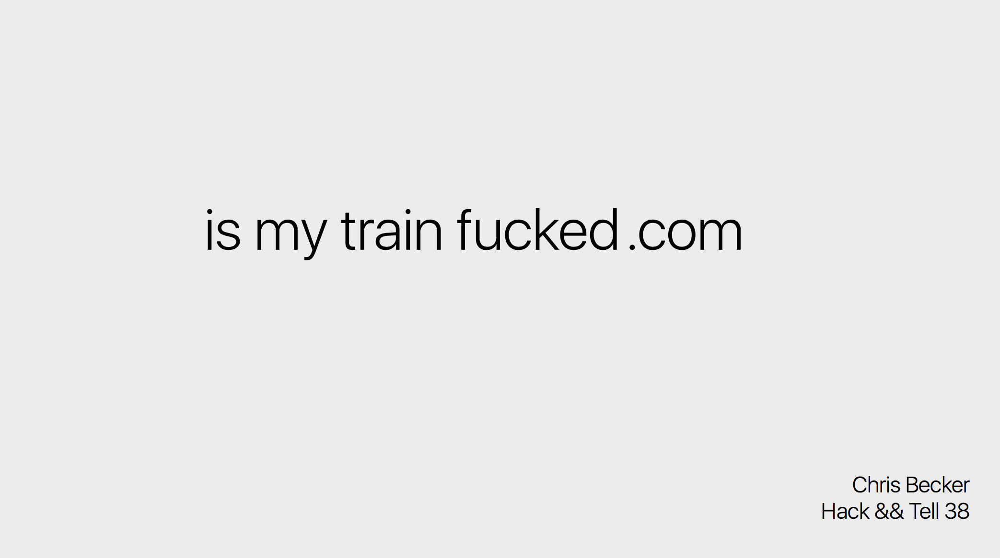
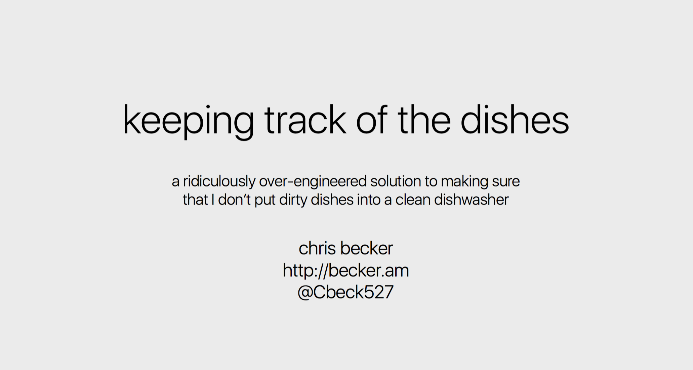
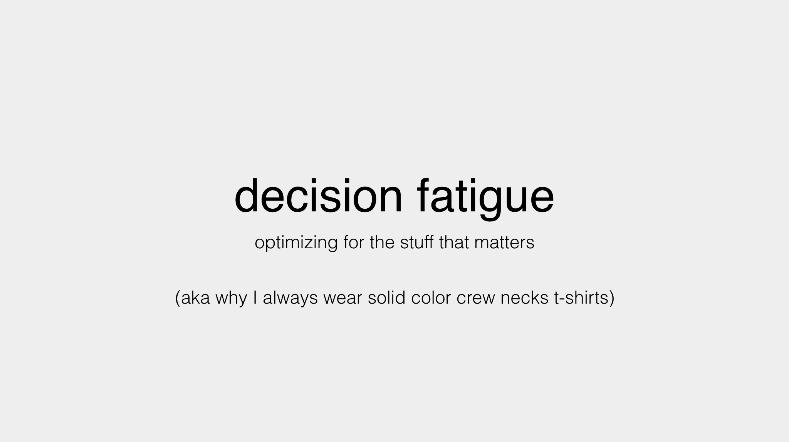
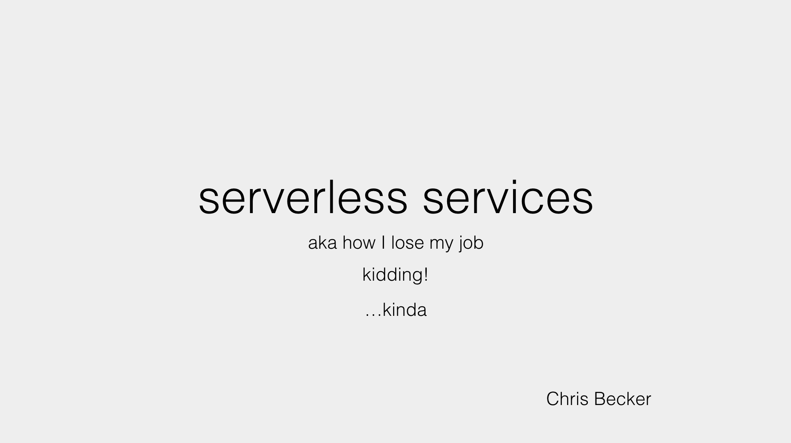

### Hack && Tell - IsMyTrainFucked.com

I
[presented](https://github.com/hackandtell/wrapup/blob/master/nyc/round-38-wrapup.md#chris-becker---is-my-train-fucked) at
one of my favorite
meetups, [Hack && Tell](https://www.meetup.com/hack-and-tell/) about my tiny
app [IsMyTrainFucked](http://ismytrainfucked.com)

### Amazon Alexa Meetup - The Dishwasher App

### Warby Parker Lightning Talk - Decision Fatigue

### Warby Parker Software Guild Talk - Serverless Services

### PyCon 2015 - Docker containers in the cloud: Provider Deathmatch

<iframe width="560" height="315" src="https://www.youtube.com/embed/yT2H-H39284" frameborder="0" allowfullscreen></iframe>

### Warby Parker Lightning Talk - The Terminal and You

<iframe width="420" height="315" src="https://www.youtube.com/embed/JJoFlTDEaV0" frameborder="0" allowfullscreen></iframe>
